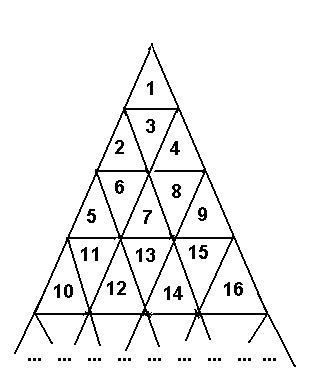

# Delta-wave 规律分析

A triangle field is numbered with successive integers in the way shown on the picture below.



The traveller needs to go from the cell with number M to the cell with number N. The traveller is able to enter the cell through cell edges only, he can not travel from cell to cell through vertices. The number of edges the traveller passes makes the length of the traveller's route.

Write the program to determine the length of the shortest route connecting cells with numbers N and M. 


## Input

    Input contains two integer numbers M and N in the range from 1 to 1000000000 separated with space(s).

## Output

    Output should contain the length of the shortest route.

## Sample Input

    6 12 

## Sample Output

    3

## 解

```c
#include<stdio.h>
#include<math.h>
void find(int n,int &l,int &r,int &level)
{
    int i;
    level=1;
    for(i=1;;i+=2)
    {
        if(n-i<=0)
        {
            l=(n+1)/2;
            r=(i-n)/2+1;
            break;
        }
        level++;
        n-=i;
    }
}

int main()
{
    int m,n;
    int ml,mr,nl,nr,mlevel,nlevel;
    while(scanf("%d%d",&m,&n)!=EOF)
    {
        find(m,ml,mr,mlevel);
        find(n,nl,nr,nlevel);
        printf("%d\n",abs(ml-nl)+abs(mr-nr)+abs(mlevel-nlevel));
    }
    return 0;
}
```

## 分析

我们可以将从M到N移动所穿过的cell层数进行分类，水平、从左到右和从右到左三种，由此可以将整个三角看作一个平面上三维的坐标系，穿过的层数即为M和N的坐标之差的绝对值之和，因此分别求出两个单元的坐标即可。

直观解法：

通过