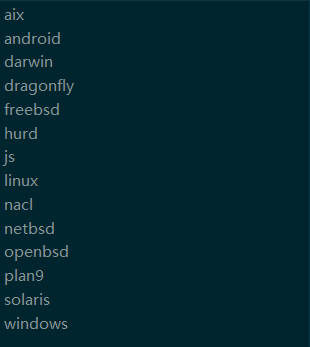

# Golang 交叉编译

## 常用参数

`GOOS` 操作系统类型

`GOARCH` 操作系统架构

- 386, amd64, amd64p32
- arm, arm64, arm64be, armbe
- mips, mips64, mips64le, mips64p32, mip64p32le, mipsle
- ppc, ppc64, ppc64le
- riscv, riscv64
- s390, s390x
- sparc, sparc64
- wasm

`CGO_ENABLED` 启用CGO

- 1, 0