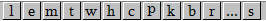

# OllyDBG使用

## 快捷键

### 顶部快捷栏

#### 字母按钮

在OllyDBG顶部有一条快捷栏, 其中有一排字母按钮分别对应打开不同的窗口来使用不同的功能.

##### 功能解释

- `l` 打开日志 (Log data)
- `e` 可执行模块 (Executable modules)
- `m` 地址映射 (Memory map)
- `t` 线程 (Threads)
- `h` 句柄
- `c`
- `p`
- `k`
- `b`
- `r`
- `...`
- `s`