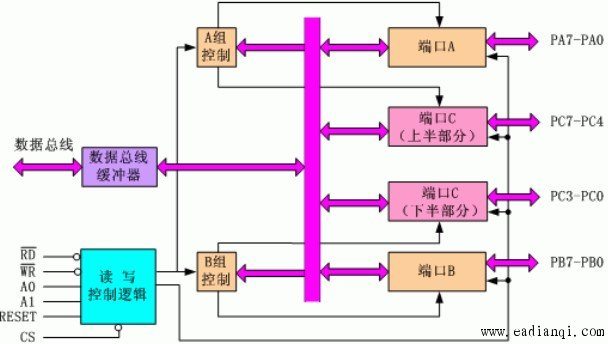

# 8255A

> 资料来源于 http://m.eadianqi.com/view.php?aid=2901

## 结构

- `CS'` 选片信号输入线
- `RESET` 复位信号输入线，复位后`PA, PB, PC`均为输入方式
- `A0, A1` 端口选择信号
- `RD'`
- `WR'`
- `D0 ~ D7` 双向三态数据总线
- 并行 IO 口 A, B, C
- `VCC` 主电源+5V
- `GND` 线路地

## 操作方式

### 方式 0

基本输入输出方式。

`PA, PB, PC`可分别定义为使用方式 0 输入或方式 0 输出。

适用于无条件传输数据的设备，双方不需要握手信息，就可使数据简单的写入或读出。 

### 方式 1

选通的输入输出方式。

此时 `PC` 口的某些位为状态控制线，作为 8255A 与外设之间的握手联络信号或作为 8255A 与 CPU 之间传送状态信息以及中断请求信号。

### 方式 2

双向输入输出工作方式。

只有 `PA` 允许工作于工作方式 2 ，在此方式下，`PA` 成为双向三态数据总线口，`PC` 口的 `PC3 ~ 7` 用于作为输入输出的握手信号。

此时 `PB` 和 `PC0~2` 可编程为方式0或方式1工作。

## 8255A 的控制字

### 方式控制字格式

|          |       D7       |                 D6                  |        D5        |          D4           |          D3           |           D2            |          D1           |          D0           |
| -------- | :------------: | :---------------------------------: | :--------------: | :-------------------: | :-------------------: | :---------------------: | :-------------------: | :-------------------: |
| 功能定义 | 方式控制字标志 |          A 组工作方式选择           | A 组工作方式选择 |         端口A         |    端口 C（PC4~7）    |      B 组方式选择       |        端口 B         |    端口 C（PC0~3）    |
|          |       1        | `00`: 方式0 `01`: 方式1 `1x`: 方式2 |                  | `0`: 输出; `1`:  输出 | `0`: 输出; `1`:  输出 | `0`: 方式0; `1`:  方式1 | `0`: 输出; `1`:  输出 | `0`: 输出; `1`:  输出 |

